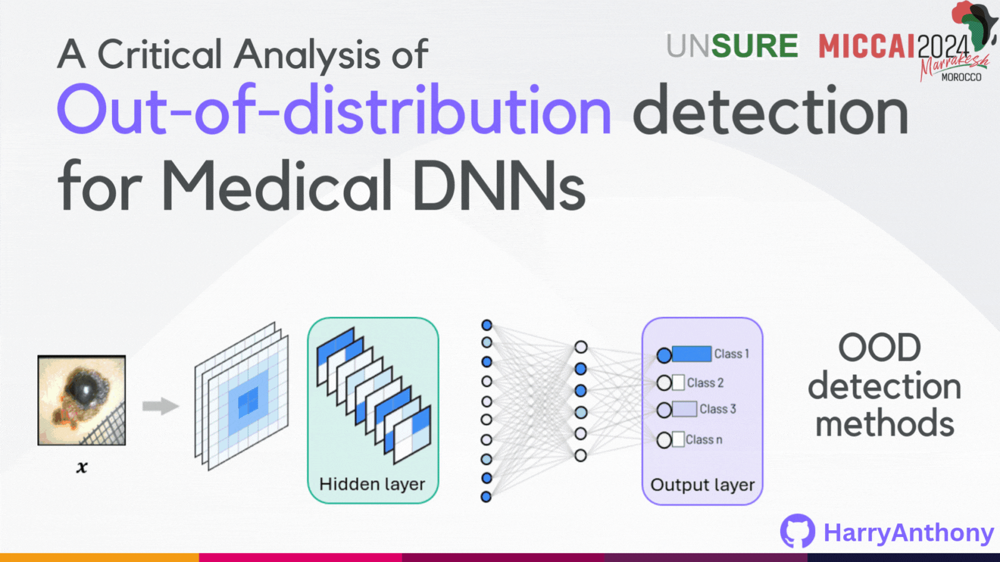
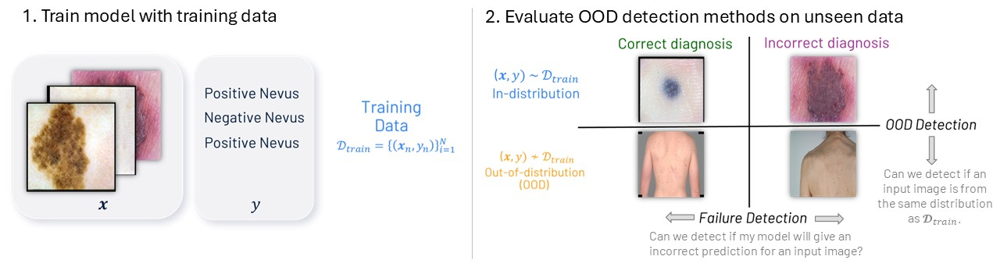

# Evaluating Reliability in Medical DNNs: A Critical Analysis of Feature and Confidence-Based Out-of-Distribution Detection

### Introduction
This repository provides several contributions:
*  Introducing two NEW medical image OOD detection benchmarks for the Dermatology (D7P) and Breast Ultrasound (BreastMNIST) datasets, including manual annotations, artefact pixel-wise segmentation masks and counterfactual images without the OOD artefacts.
*  A framework which contains over 15 out-of-distribution (OOD) detection methods that can be applied to pre-trained neural networks.

<p align="center">
    
</p>

This repository contains code and data which corresponds to the paper [1]. The work studies OOD detection methods that can be applied on pre-trained deep neural networks which are trained on a specific task of interest (i.e disease classifcation) - known as _post-hoc_ OOD detection methods. The framework can be used to study the performance of both _confidence-based_ and _feature-based_ OOD detection methods. Moreover, the repository contains two new real-world OOD detection benchmarks (for skin lesions and Breast ultrasound images) which can be used to analyse the effectiveness of these OOD detection methods. I hope this work will inspire future works into OOD detection for medical image analysis. If these ideas, code or dataset helped influence your research, please cite the following paper (bibtex given at bottom of Readme).

[1] **Harry Anthony**, Konstantinos Kamnitsas “[Evaluating Reliability in Medical DNNs: A Critical Analysis of Feature and Confidence-Based OOD Detection](https://link.springer.com/chapter/10.1007/978-3-031-73158-7_15)” In: Uncertainty for Safe Utilization of Machine Learning in Medical Imaging. UNSURE 2024. 

### Table of Contents
* [1. Out-of-distribution detection methods overview](#1-out-of-distribution-detection-methods-overview)
* [2. Requirements](#2-requirements)
	* [a. Installation requirements](#a-installation-requirements)
 	* [b. Data requirements](#b-data-requirements)
* [3. New data](#3-new-data)
	* [a. New Out-of-distribution Benchmarks](#a-new-out-of-distribution-benchmarks)
 	* [b. New Counterfactual Data](#b-new-counterfactual-data)	
* [3. Usage Instructions](#3-usage-instructions)
	* [a. Training models](#a-training-models)
	* [b. Applying OOD detection methods](#b-applying-ood-detection-methods)
* [4. Citation](#4-citation)
* [5. Acknowledgements](#5-acknowledgements)
* [5. License](#5-license)


### 1. Out-of-distribution detection methods overview

Reliable use of deep neural networks (DNNs) for the application of medical image analysis in clinical settings requires methods to identify inputs that differ significantly from the training data, called out-of-distribution (OOD), to prevent erroneous predictions on unseen data. Consider training a deep neural network for medical image classification with images, $\mathbf{x} \in \mathcal{X}$ and corresponding labels 
$`y \in \mathcal{Y} = \{  1,...,K \}`$
from a label-space with K classes. The DNN, $f$, is trained with data $`\mathcal{D}_{\text{train}} = \{ (x_n, y_n) \}_{n=1}^N \subset \mathcal{X} \times \mathcal{Y}`$. 
OOD detection can be viewed as a binary classification problem, where we get a confidence scoring function from our method $\mathcal{S}(\mathbf{x},f)$ for an input $\mathbf{x}$.  We label $\mathbf{x}$ as OOD when the scoring function $\mathcal{S}(\mathbf{x},f)$ is below a threshold $\lambda$, and ID if it is above. 
```math
G_{\lambda}(\mathbf{x} , f)= \begin{cases}\text { OOD } & \text { if } \mathcal{S}(\mathbf{x},f) \leq \lambda \\ \text { ID } & \text { if } \mathcal{S}(\mathbf{x},f) > \lambda \end{cases}
```
The primary metric for evaluating the performance of OOD detection is AUROC$`_{\text{OOD}}`$, which assesses the scoring function's ability to distinguish ID from OOD inputs. However, there is a growing body of research which is arguing we should evaulate methods using the _failure_ _detection_ framework [2], which seeks to distinguish between inputs where the model's diagnosis is accurate from those where it is not. We can evaluate the confidence-scoring functions abilities for _failure_ _detection_, which we quantify using AUROC$`_{f}`$. For AUROC$`_{\text{OOD}}`$ the true label is ID and the false label is OOD, and for AUROC$`_{f}`$ the true label is a correct diagnosis and false label is an incorrect diagnosis.

<p align="center">
    
</p>

**Figure 1**: Figure of the workflow for evaluate OOD detection. 1. The model is trained with training data for image classification. 2. Once the model is trained, we can apply OOD detection methods on unseen images. We can then evaluate methods on their ability to identify if an input is from a different distribution as the training data (OOD detection) and their ability to detect if a model will give an incorrect diagnosis on an input image (Failure detection).

This study analyses _post-hoc_ _OOD_ _detection_ _methods_, which use the parameters or outputs of a pre-trained model (trained for a task of interest, e.g. skin lesion image classification) for out-of-distribution detection. *Post-hoc OOD detection* methods can be categorised as either confidence-based (using the model’s output layer for OOD detection) or feature-based (not using the output layer). Figure 1 visualises the post-hoc OOD detection methods that this repository supports.

<p align="center">
    
</p>

**Figure 2**: Dendograph of the OOD detection methods supported by this repository, separated by feature-based methods and confidence-based methods.

This framework can be used to study the abilities of these methods for both Out-of-distribution detection and Failure detection. For example, in paper [1] it is shown emperically that that feature-based methods typically perform better at OOD detection than confidence-based methods, whereas confidence-based methods typically perform better at failure detection than feature-based methods (see Figure 2). 

<p align="center">
	
</p>

**Figure 3**: feature-based methods typically perform better at OOD detection than confidence-based methods, whereas confidence-based methods typically perform better at failure detection than feature-based methods. AUROC$`_{\text{OOD}}`$  and AUROC$`_{\text{f}}`$  (mean of 5 seeds) for OOD detection methods for BreastMNIST (annotation OOD) task (top) and D7P (ruler OOD) task (bottom). Results are taken from [1].


### 2. Requirements
 
#### a. Installation requirements
The system requires the following (latest version tested):
- [Python](https://www.python.org/downloads/): Developed using Python 3 (3.9.12).
- [numpy](http://www.numpy.org/) : Package for analysing and using arrays (1.24.2).
- [scipy](http://www.scipy.org/) : Scientific packages used for image transformations (1.9.3).
- [PyTorch](https://pytorch.org/) : Library for deep learning (1.13.0).
- [Torchvision](https://pytorch.org/vision/stable/index.html#module-torchvision) : Library used for datasets, transforms, and models (0.14.0).
- [pandas](https://pandas.pydata.org/) : Data manipulation and analysis library (1.5.2).
- [Pillow](https://pillow.readthedocs.io/en/stable/): Library for image processing (9.2.0).
- [Scikit-image](https://scikit-image.org/): Library for image processing and adaptation (0.19.3).

The project can be cloned using
```
$ git clone https://github.com/HarryAnthony/Evaluating_OOD_detection/
```

#### b. Data requirements
This research was completed on two public Medical Datasets. To reproduce the results in [1], please download the datasets following the next instructions and place the data in the `data` directory. The configurations for each dataset are given in the `source/config` directory.

##### i) 7-point criteria evaluation Database (D7P)
The 7-point criteria evaluation Database (D7P) [3] is a dermatology dataset for the prediction of the 7-point skin lesion malignancy checklist. The dataset includes over 2000 2D images. More information about the data, along with instructions on how to download the data can be found [here](https://derm.cs.sfu.ca/Welcome.html). Once downloaded, the data should be placed in the `data/D7P` directory.

##### ii) BreastMNIST
BreastMNIST [4,5] is a Breast Ultrasound Dataset from the collection [MedMNIST](https://medmnist.com/). The BreastMNIST dataset has three classes: Normal (no lesion), benign (bengin tumour), malignant (malignant tumour). The BreastMNIST dataset contains 780 images. BreastMNIST data can be downloaded [here](https://zenodo.org/records/10519652) or using the MedMNIST dataset API: 
```
pip install medmnist
```
Once downloaded, the data should be placed in the `data/BreastMNIST` directory.


### 3. New Data

#### a. New Out-of-distribution Benchmarks
A contribution is the work is the development of two new Medical OOD detection benchmarks, which we are making public to be used to evaluate and improve current OOD detection methods. We hope they will be useful for assessment of OOD methods in future works by the community. Please cite this work if you use this data in your research.

<p align="center">
    
</p>

##### i) 7-point criteria evaluation Database (D7P)
The *D7P* dataset was annotated into five different sub-sets, which are visualised in Figure 3. The paths of the image in each categorey can be found in the textfile:
1. `no_rulers.txt`: A list of images which do not contain any type of ruler in the image.
2. `ruler_type_1.txt`: A list of images which contain a black grid ruler.
3. `ruler_type_2.txt`: A list of images which contain an opaque white ruler.
4. `ruler_type_3.txt`: A list of images which contain a ruler which is different from type 1 and type 2.
5. `uncertain.txt`: A list of low_quality images in which it is difficult to determine which of the other categories it should be placed. Due to the quality concerns, these images are not used when training the model.

For our study we used the images with no rulers (1) as our in-distribution cases, and the images with grid rulers (2) as our OOD cases. We trained on 90% of the images with no rulers to classify between images with Nevus (a benign mole) and without Nevus. Once the model was trained, the OOD detection method was applied to try and separate the held-out ID images (10% ID images) with no rulers from the images with rulers (OOD).

##### ii) BreastMNIST
The *BreastMNIST* dataset was annotated into two different sub-sets:
* `no_annotations.txt`: A list of images which do not contain any annotations.
* `annotations.txt`: A list of images which contain an annotation in the scan.

For our study we used images with no annotations as our in-distribution cases, and images with annotations as our OOD cases.We trained on 90% of the images with no annotations to classify between images with No Lesion (called Normal), images with a benign tumour and images with a malignant tumour. Once the model was trained, the OOD detection method was applied to try and separate the held-out ID images (10% ID images) with no annotations from the images with annotations (OOD).

<p align="center">
	
</p>

**DISCLAIMER**: These annotations were made by author Harry Anthony (PhD candidate in Engineering Science) based on visual inspection, and were **not validated by medical experts**. This data is for **research purposes only**. This dataset is NOT intended for clinical use. 


### b. New Counterfactual Data
We created two new counterfactual datasets by synthetically removing the OOD artefact from each image. This was done using intra-image interpolation, where we use a patch from the **same image** to remove the OOD artefact. This was chosen over using a generative model as it ensures we are not introducing a new OOD artefact, and it ensures the image label isn't changed (i.e. introducing a nevus patch to a non-nevus image). It is important to note that a smoothing filter was used between the introduced patch and the original image to ensure a smooth transition. Although we understand that this introduces some bias, we believe this is a useful tool for approximately studying the impact of an OOD artefact on both the model's diagnosis, as well as the OOD detection methods. The synthetic counterfactual data and more details on how the data was created, can be found in the directory `data`.

<p align="center">
	
</p>


### 3. Usage Instructions

#### a. Training models
To train a deep neural network using the same settings in [1], please use the code:
```
python3 training.py [--act_func ACT_FUNC] [--act_func_dropout ACT_FUNC_DROPOUT] [--allow_repeats ALLOW_REPEATS] [--batch_size BATCH_SIZE] [--class_selections CLASS_SELECTIONS] 
                    [--cuda_device CUDA_DEVICE] [--dataset DATASET] [--dataset_seed DATASET_SEED] [--dataset_selections DATASET_SELECTIONS] [--demographic_selections DEMOGRAPHIC_SELECTIONS]
                    [--depth DEPTH] [--dropout DROPOUT] [--fold FOLD] [--label_smoothing LABEL_SMOOTHING] [--lr LR] [--max_lr MAX_LR] [--net_type NET_TYPE] 
                    [--Optimizer OPTIMIZER] [--save_model SAVE_MODEL] [--Scheduler SCHEDULER] [--seed SEED] [--setting SETTING] [--train_val_test_split_criteria TRAIN_VAL_TEST_SPLIT_CRITERIA] 
                    [--verbose VERBOSE] [--widen_factor WIDEN_FACTOR]
```
The arguments of the file allow the user to control the how the model is trained. For training models on the D7P and BreastMNIST dataset, there are pre-made settings which can be used with the ` --setting` argument:
* For D7P, use argument `--setting setting1` to train a model to classify between Positive Nevus and Negative Nevus just using images with **no** **rulers**.
* For BreastMNIST, use argument `--setting setting1` to train a model to classify between Normal, Benign and Malignant Ultrasound scans with **no** **annotations**.

If the `--setting` argument is not one of the above, then the parser arguments will be used to select the data to train the model. The configurations of each of the models that are trained using this file are saved to the file `outputs/checkpoint/Model_list.csv`.


#### b. Applying OOD detection methods
Given the seed of the experiment, saved in the file `checkpoint/model_list.csv`, OOD detection methods can be applied using the file:
```
python3 evaluate_OOD_detection_method.py [--batch_size BATCH_SIZE] [--cuda_device CUDA_DEVICE] [--deep_ensemble_seed_list DEEP_ENSEMBLE_SEED_LIST] [--evaluate_ID_accuracy EVALUATE_ID_ACCURACY] 
                                         [--evaluate_OOD_accuracy EVALUATE_OOD_ACCURACY] [--filename FILENAME] [--mahalanobis_layer MAHALANOBIS_LAYER] [--MCDP_samples MCDP_SAMPLES]
                                         [--method METHOD] [--noiseMagnitude NOISEMAGNITUDE] [--ood_class_selections OOD_CLASS_SELECTIONS] [--ood_dataset OOD_DATASET] 
                                         [--ood_dataset_selections OOD_DATASET_SELECTIONS] [--ood_demographic_selections OOD_DEMOGRAPHIC_SELECTIONS] 
                                         [--ood_train_val_test_split_criteria OOD_TRAIN_VAL_TEST_SPLIT_CRITERIA] [--ood_type OOD_TYPE] [--plot_metric PLOT_METRIC] 
                                         [--return_metrics RETURN_METRICS] [--save_results SAVE_RESULTS] [--seed SEED] [--temperature TEMPERATURE] [--verbose VERBOSE]
```
If the model was trained with `--setting setting1`, the OOD task will be:
* D7P: ID test data is unseen images with no rulers, OOD data is images with grid rulers.
* BreastMNIST: ID test data is the unseen images with no annotations, OOD data is images with annotations.

The OOD task can be changed using the argument `--ood_type`:
* `different_class` : use data from an unseen class from the same dataset as the OOD test cases. 
* `synthetic` : adds a synthetic artefact using `Image_augmentations.py` to the ID test dataset to be the OOD test cases.
* `different_database` : use in conjunction with `ood_dataset`  to use another dataset as the OOD test cases.

Once the OOD test dataset is decided, the OOD detection method that is used is chosen with the `--method` argument, with the available methods listed in figure 2. Each method will print the OOD AUROC and AUCPR of the scoring function. To save the outputs, use the function `--save_results` which will save the scoring function for the ID cases and the OOD cases.


### 4. Citation
I hope this work is useful for further understanding how neural networks behave when encountering an OOD input. If you found this work useful or have any comments, do let me know.  Please email me your feedback or any issues to: **harry.anthony@eng.ox.ac.uk**.

When citing this research, please use the bibTex:
```
@InProceedings{Anthony_2024,
author="Anthony, Harry
and Kamnitsas, Konstantinos",
editor="Sudre, Carole H.
and Mehta, Raghav
and Ouyang, Cheng
and Qin, Chen
and Rakic, Marianne
and Wells, William M.",
title="Evaluating Reliability in Medical DNNs: A Critical Analysis of Feature and Confidence-Based OOD Detection",
booktitle="Uncertainty for Safe Utilization of Machine Learning in Medical Imaging",
year="2024",
publisher="Springer Nature Switzerland",
address="Cham",
pages="160--170",
}
```

### 5. Acknowledgments

[2]: Guerin, J., Delmas, K., Ferreira, R. and Guiochet, J.: Out-of-distribution de-tection is not all you need. In: AAAI. vol. 37, pp. 14829–14837 (2023)

[3]: Kawahara, J., Daneshvar, S., Argenziano, G. and Hamarneh, G.: 7-Point Check- list and Skin Lesion Classification using Multi-Task Multi-Modal Neural Nets. IEEE journal of biomedical and health informatics (2018)

[4]: Yang, J., Shi, R., Wei, D. and Liu, : MedMNIST v2 - A large-scale lightweight benchmark for 2D and 3D biomedical image classification. Scientific Data 10 (1) (2023)

[5]: Walid Al-Dhabyani, Mohammed Gomaa, et al., "Dataset of breast ultrasound images," Data in Brief, vol. 28, pp. 104863, 2020. 


### 5. License

MIT License

Copyright (c) 2024 Harry Anthony

Permission is hereby granted, free of charge, to any person obtaining a copy
of this software and associated documentation files (the "Software"), to deal
in the Software without restriction, including without limitation the rights
to use, copy, modify, merge, publish, distribute, sublicense, and/or sell
copies of the Software, and to permit persons to whom the Software is
furnished to do so, subject to the following conditions:

The above copyright notice and this permission notice shall be included in all
copies or substantial portions of the Software.

THE SOFTWARE IS PROVIDED "AS IS", WITHOUT WARRANTY OF ANY KIND, EXPRESS OR
IMPLIED, INCLUDING BUT NOT LIMITED TO THE WARRANTIES OF MERCHANTABILITY,
FITNESS FOR A PARTICULAR PURPOSE AND NONINFRINGEMENT. IN NO EVENT SHALL THE
AUTHORS OR COPYRIGHT HOLDERS BE LIABLE FOR ANY CLAIM, DAMAGES OR OTHER
LIABILITY, WHETHER IN AN ACTION OF CONTRACT, TORT OR OTHERWISE, ARISING FROM,
OUT OF OR IN CONNECTION WITH THE SOFTWARE OR THE USE OR OTHER DEALINGS IN THE
SOFTWARE.
