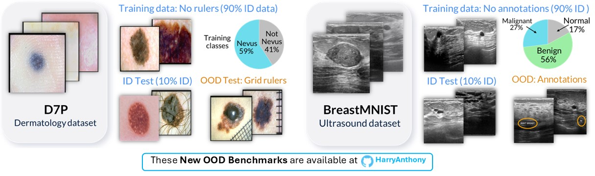

## Data requirements
This research was completed on two public Medical Datasets. To reproduce the results in [1], please download the datasets following the next instructions and place the data in the `data` directory. The configurations for each dataset are given in the `source/config` directory.

### i) 7-point criteria evaluation Database (D7P)
The 7-point criteria evaluation Database (D7P) [3] is a dermatology dataset for the prediction of the 7-point skin lesion malignancy checklist. The dataset includes over 2000 2D images. More information about the data, along with instructions on how to download the data can be found [here](https://derm.cs.sfu.ca/Welcome.html). Once downloaded, the data should be placed in the `data/D7P` directory.

### ii) BreastMNIST
BreastMNIST [4,5] is a Breast Ultrasound Dataset from the collection [MedMNIST](https://medmnist.com/). The BreastMNIST dataset has three classes: Normal (no lesion), benign (bengin tumour), malignant (malignant tumour). The BreastMNIST dataset contains 780 images. BreastMNIST data can be downloaded [here](https://zenodo.org/records/10519652) or using the MedMNIST dataset API: 
```
pip install medmnist
```
Once downloaded, the data should be placed in the `data/BreastMNIST` directory.


## New Data

### a. New Out-of-distribution Benchmarks
A contribution is the work is the development of two new Medical OOD detection benchmarks, which we are making public to be used to evaluate and improve current OOD detection methods. We hope they will be useful for assessment of OOD methods in future works by the community. Please cite this work if you use this data in your research.

<p align="center">
    
</p>

#### i) 7-point criteria evaluation Database (D7P)
The *D7P* dataset was annotated into five different sub-sets, which are visualised in Figure 3. The paths of the image in each categorey can be found in the textfile:
1. `no_rulers.txt`: A list of images which do not contain any type of ruler in the image.
2. `ruler_type_1.txt`: A list of images which contain a black grid ruler.
3. `ruler_type_2.txt`: A list of images which contain an opaque white ruler.
4. `ruler_type_3.txt`: A list of images which contain a ruler which is different from type 1 and type 2.
5. `uncertain.txt`: A list of low_quality images in which it is difficult to determine which of the other categories it should be placed. Due to the quality concerns, these images are not used when training the model.

For our study we used the images with no rulers (1) as our in-distribution cases, and the images with grid rulers (2) as our OOD cases. We trained on 90% of the images with no rulers to classify between images with Nevus (a benign mole) and without Nevus. Once the model was trained, the OOD detection method was applied to try and separate the held-out ID images (10% ID images) with no rulers from the images with rulers (OOD).

#### ii) BreastMNIST
The *BreastMNIST* dataset was annotated into two different sub-sets:
* `no_annotations.txt`: A list of images which do not contain any annotations.
* `annotations.txt`: A list of images which contain an annotation in the scan.

For our study we used images with no annotations as our in-distribution cases, and images with annotations as our OOD cases.We trained on 90% of the images with no annotations to classify between images with No Lesion (called Normal), images with a benign tumour and images with a malignant tumour. Once the model was trained, the OOD detection method was applied to try and separate the held-out ID images (10% ID images) with no annotations from the images with annotations (OOD).

<p align="center">
	
</p>

**DISCLAIMER**: These annotations were made by author Harry Anthony (PhD candidate in Engineering Science) based on visual inspection, and were **not validated by medical experts**. This data is for **research purposes only**. This dataset is NOT intended for clinical use. 


## b. New Counterfactual Data
We created two new counterfactual datasets by synthetically removing the OOD artefact from each image. This was done using intra-image interpolation, where we use a patch from the **same image** to remove the OOD artefact. This was chosen over using a generative model as it ensures we are not introducing a new OOD artefact, and it ensures the image label isn't changed (i.e. introducing a nevus patch to a non-nevus image). It is important to note that a smoothing filter was used between the introduced patch and the original image to ensure a smooth transition. Although we understand that this introduces some bias, we believe this is a useful tool for approximately studying the impact of an OOD artefact on both the model's diagnosis, as well as the OOD detection methods. The synthetic counterfactual data and more details on how the data was created, can be found in the directory `data`.

<p align="center">
	
</p>

